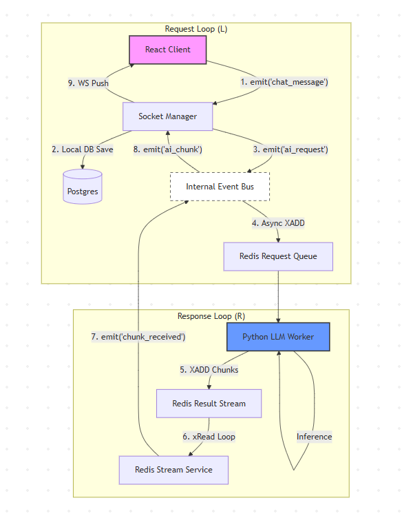

# AI Evaluator: The Enterprise-Grade Reliability Layer for LLMs

[](https://reactjs.org/)
[](https://nodejs.org/)
[](https://fastapi.tiangolo.com/)
[](https://www.postgresql.org/)
[](https://www.prisma.io/)
[](https://www.typescriptlang.org/)
[](https://www.python.org/)
[](https://tailwindcss.com/)
[](https://ui.shadcn.com/)

**AI-Evaluator** is an open-source SaaS infrastructure designed to bridge the gap between stochastic `LLM` outputs and deterministic business requirements. By implementing a sophisticated **Human-in-the-Loop (HITL)** evaluation framework, we empower developers and enterprises to build, verify, and scale reliable AI applications.

---

## The Investor Perspective

### The Problem
Traditional AI deployments suffer from a "Black Box" problem. Without a structured way to evaluate, rate, and correct `Large Language Model` responses in real-time, businesses face significant risks in production reliability and brand safety.

### Our Solution
`AI-Evaluator` provides a specialized diagnostic layer. Built on a scalable **two-service architecture**, it separates core business logic (managed by `Node.js` & `TypeScript`) from heavy model inference (handled by `Python` & `FastAPI`). This allows for:
- **Traceable Correction Paths:** Every AI interaction is captured in `PostgreSQL` via `Prisma` for future fine-tuning.
- **Cost-Effective Scaling:** Independent scaling of the inference layer (`Python`) and the API layer (`Node.js`).
- **Rapid Iteration:** A modern `React` frontend built with `Vite` and `TailwindCSS` for immediate internal deployment.

---

## Advanced Tech Stack (Tagged)

### Frontend Engine
- **Core:** `React 18` + `Vite` for ultra-fast development and optimized production bundles.
- **Language:** `TypeScript` (Strict Mode) ensures enterprise-grade type safety.
- **Styling:** `TailwindCSS` for a modern, responsive design system.
- **Components:** `Shadcn UI` + `Lucide React` icons for a premium, accessible user experience.
- **Logic Handling:** `Framer Motion` for smooth micro-animations and `React Router` for seamless navigation.

### Backend Infrastructure
- **Runtime:** `Node.js` (ESM Architecture) for high-concurrency request handling.
- **Framework:** `Express.js` provides a robust, predictable API structure.
- **Persistence:** `PostgreSQL` utilizing `JSONB` for storing complex AI message structures and metadata.
- **ORM:** `Prisma v7` with `Driver Adapters` (`@prisma/adapter-pg`) for high-performance connection pooling.
- **Evaluation Logic:** Native `PATCH` workflows for real-time rating and evaluation storage.

### AI Inference Layer
- **Framework:** `FastAPI` (`Python 3.9+`) designed for high-performance asynchronous `LLM` calls.
- **Inference Models:** Extensible interface to support `OpenAI`, `Anthropic`, and local `Llama`/`DeepSeek` models.

---

## System Design (Base Architecture)




---

## Key Enterprise Features

- **Atomic Transactional History:** Utilizing `Prisma` transactions to ensure message integrity between users and AI bots.
<!-- - **Context-Aware Sidebar:** Intelligent sorting of conversations using `PostgreSQL` `updatedAt` timestamps for maximum user productivity.
- **Rich Structured Content:** Full support for code blocks, specialized `JSON` metadata, and multi-modal responses stored in `PostgreSQL` `JSONB` columns.
- **Real-time Diagnostic Dashboard:** A dedicated interface for domain experts to evaluate AI accuracy without touching a single line of code. -->

---

## Roadmap

- [x] **Phase 1: Foundation** - Dual-service architecture with `Node.js` and `FastAPI`.
<!-- - [x] **Phase 2: HITL Integration** - Basic evaluation and rating system for `React` messages.
- [ ] **Phase 3: Deep Insights** - Advanced analytics dashboard visualizing `LLM` drift and alignment scores over time.
- [ ] **Phase 4: Multi-Model Gateway** - Automated A/B testing between different `LLM` providers (e.g., comparing `GPT-4` vs `Claude 3.5`). -->

---

## Collaboration & Investment

We are building the future of AI reliability. We welcome:
- **Collaborators:** `Fullstack Developers` (TS/React) and `AI Engineers` (Python/FastAPI) looking to contribute to a high-impact open-source project.
- **Investors:** Visionaries who recognize that the next decade of AI isn't just about *generation*, but *verification*.

For partnership inquiries, please open a GitHub Issue or reach out via our [Project Website].

---

## Quick Start for Developers

### Basic Installation

1. **Database and Redis Bootstrap:**
   ```bash
   chmod +x ./local.entry.sh
   ./local.entry.sh 
   # Launches a Dockerized PostgreSQL and Redis instance
   ```

2. **Backend Setup (`Node.js`):**
   ```bash
   cd node-evaluator-backend
   npm install
   npm run prisma:migrate
   npm run dev
   ```

3. **Frontend Setup (`React`):**
   ```bash
   cd rc-evaluator
   npm install
   npm run dev
   ```


